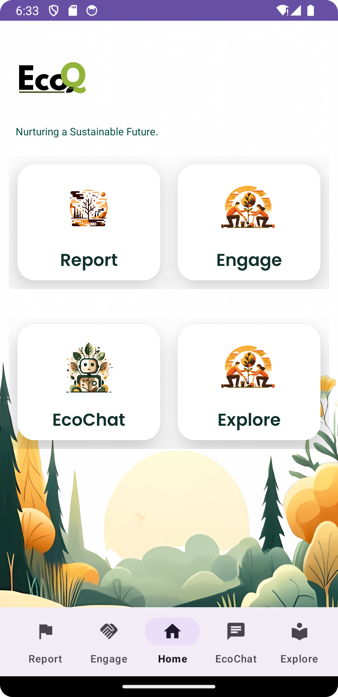
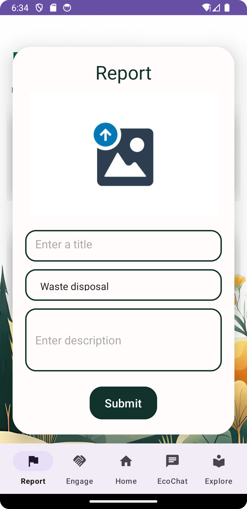
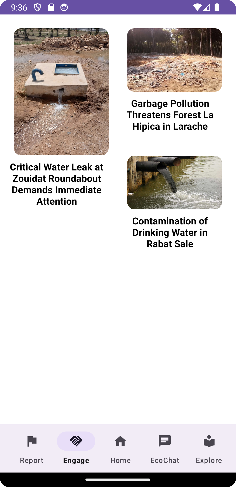
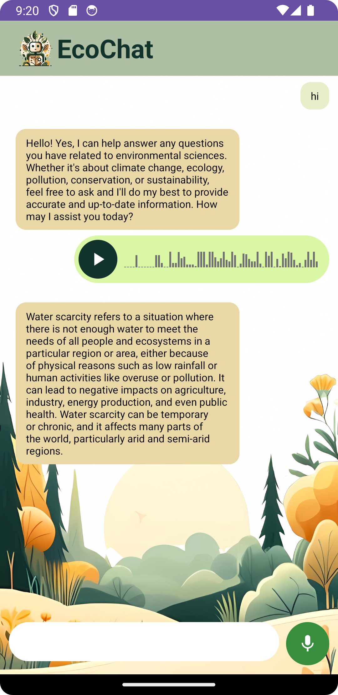

------
## Abstract
In response to the escalating environmental challenges of our time, fostering awareness and encouraging collective action are crucial steps toward a sustainable future. Our project, EcoQ, addresses this need by introducing a mobile app designed to empower individuals in contributing to environmental well-being. This app combines a user-friendly reporting interface for submitting environmental issues with community engagement features and an informative chatbot to answer environment-related queries, and promote eco-friendly practices. EcoQ is not just an app: it's a catalyst for positive change, encouraging users to play an active role in building a more sustainable world.

## Background and Problem Statement
Climate change poses a significant threat to our planet, necessitating urgent and collective action. One major challenge in addressing environmental issues is the limited awareness and engagement among individuals. The need for real-time community involvement is crucial in combating the adverse effects of climate change. Additionally, the difficulty in effectively communicating the severity of environmental issues further hinders timely and appropriate responses.

## Solution: EcoQ
Our Impact, Our Future: Can We Shift the Course?

We recognize the pressing need to bridge these gaps and empower individuals to be active participants in environmental initiatives. We designed EcoQ is a mobile application dedicated to fostering environmental awareness and facilitating community-driven initiatives. By providing users with a user-friendly "report" interface, EcoQ enables individuals to easily capture and report environmental concerns such as water wastage and improper waste disposal. This streamlines the reporting process, ensuring that problems are communicated promptly and accurately. Additionally, EcoQ features EcoChat, a helpful chatbot dedicated to answering environment-related questions.

|||||
|:-----------------------------------------------------:|:-----------------------------------------------------:|:------------------------------------------------------------:|:------------------------------------------------------------:|
| Home                                        | Report                          | Engage                                          | EcoChat                                          |

## EcoQ Impact
At EcoQ, our mission is to drive transformative change at both the individual and community levels, creating a collective impact on the environment. Through empowering individuals, we serve as catalysts for change, encouraging them to report environmental concerns and actively participate in fostering an eco-friendly mindset. Our platform guides individuals towards embracing sustainable practices, sparking a revolution that transcends individual actions. Through community collaboration, EcoQ cultivates a strong sense of unity, where every member becomes an eco-warrior contributing to a shared vision of positive change. From reports to tangible results, we are committed to making a lasting environmental impact. Concerned individuals are not just contributors but the driving force behind the development and implementation of environmentally conscious policies. At EcoQ, we believe in the power of each person's actions to collectively shape a greener, more sustainable future for our planet.
