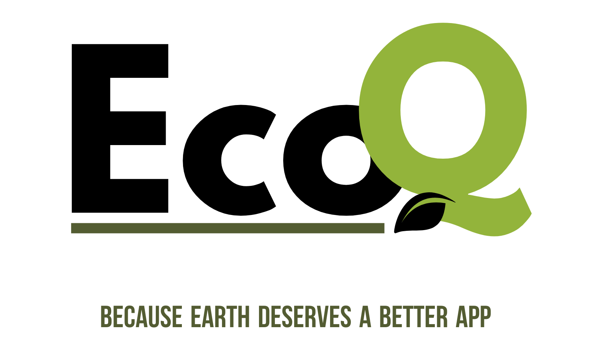

------
## Abstract

## Background and Problem Statement
Climate change poses a significant threat to our planet, necessitating urgent and collective action. One major challenge in addressing environmental issues is the limited awareness and engagement among individuals. The need for real-time community involvement is crucial in combating the adverse effects of climate change. Additionally, the difficulty in effectively communicating the severity of environmental issues further hinders timely and appropriate responses.

## Solution
Our Impact, Our Future: Can We Shift the Course?

We recognize the pressing need to bridge these gaps and empower individuals to be active participants in environmental initiatives. We designed EcoQ is a mobile application dedicated to fostering environmental awareness and facilitating community-driven initiatives. By providing users with a user-friendly "report" interface, EcoQ enables individuals to easily capture and report environmental concerns such as water wastage and improper waste disposal. This streamlines the reporting process, ensuring that problems are communicated promptly and accurately. Additionally, EcoQ features EcoChat, a helpful chatbot dedicated to answering environment-related questions.
