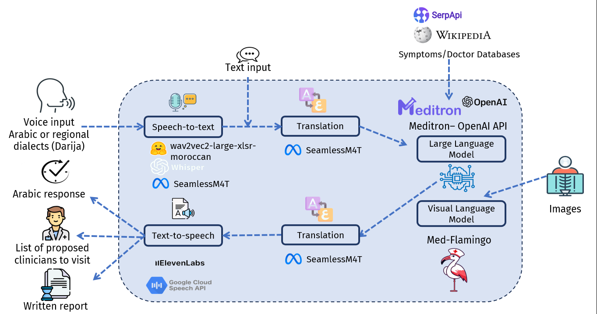

# SehhaTech

## Background and problem statement:

The problem addressed by SehhaTech is the shortage of healthcare staff, a common challenge that many regions face. This shortage often leads to increased workload on existing healthcare providers, longer wait times for patients, and challenges in delivering timely and effective healthcare services. This issue can result in delayed diagnoses, increased patient dissatisfaction, and overall inefficiencies in the healthcare system.

## Our solution:

SehhaTech aims to mitigate this problem by introducing a multimodal AI medical assistant. The system supports both standard Arabic and regional dialects, making it accessible to a broader population. Patients can interact with the assistant using various modalities such as audio, text, and medical imagery, providing a versatile and inclusive means of communication.

The key innovation lies in the system's ability to closely replicate an interaction with an experienced healthcare provider. By comprehending patients' concerns and asking concise questions, SehhaTech efficiently collects relevant information. The solution's report generation system plays a crucial role in streamlining the healthcare process. It translates the gathered information into a comprehensive report that is then delivered to the attending clinician. This not only helps in expediting the diagnostic process but also ensures that healthcare providers have a detailed overview of the patient's condition, enabling them to make more informed and faster decisions.

Additionally, SehhaTech goes beyond traditional assistance by utilizing its conversational capabilities to identify the specific medical specialty the patient needs. Moreover, it goes a step further by proposing a list of suitable doctors within the identified specialty, thereby facilitating the patient's decision-making process and expediting the referral to the right healthcare professional. This feature not only enhances the overall efficiency of the healthcare system but also contributes to a more personalized and streamlined patient experience.
## Team

-  [Soufiane DAHIMI](https://www.linkedin.com/in/soufiane-dahimi/)
-  [Yassmine ED-DYB](https://www.linkedin.com/in/yassmineeddyb/)
-  [Abir HARRASSE](https://www.linkedin.com/in/abir-harrasse-a5120b20a/)

## Overview of SehhaTech:

  

Our project consists of 4 components:

#### Speech to text:

## Notes:

In the process of developing this work, we drew inspiration from and gained insights from various technologies and sources, including:[Med- Flamingo](https://arxiv.org/pdf/2307.15189v1.pdf), [LangChain](https://python.langchain.com/docs/get_started/introduction), [SeamlessM4T](https://github.com/facebookresearch/seamless_communication), [Gradio](https://www.gradio.app/), [Few shot Prompting](https://promptengineering.org/master-prompting-concepts-zero-shot-and-few-shot-prompting/#:~:text=What%20is%20Few%2DShot%20Prompting,examples%20of%20input%2Doutput%20pairs), [CoT](https://cobusgreyling.medium.com/chain-of-thought-prompting-in-llms-1077164edf97), [PEFT](https://github.com/huggingface/peft).  
    
These references have played a significant role in shaping our work and expanding our knowledge in this field.

## Visualization:

https://github.com/Yassmine2020/SehhaTech/assets/85367800/e39b1acb-203c-4ce2-9b80-43fa61bfea1a

## Project Structure:

 ├─[SourceCode](Source%20Code) 
 │ ├─[DemoSehhatech](Source%20Code/DemoSehhatech.ipynb)   # Demo code  
 │ ├─[test](Source%20Code/test)  # test-related files  
 │ │ ├─[input_img](Source%20Code/test/input_img)   # Inference images  
 │ │ ├─[output_report](Source%20Code/test/output_report)   # Inference result  

## Usage:

To use SehhaTech on your machine you can …

  - Step 1: clone the repository
  - Step 2: run the file "DemoSehhatech.ipynb"
