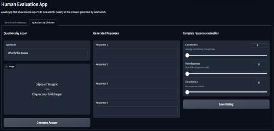
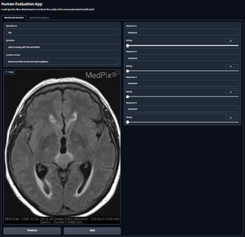

# SehhaTech

## Background and problem statement:

The problem addressed by SehhaTech is the shortage of healthcare staff, a common challenge that many regions face. This shortage often leads to increased workload on existing healthcare providers, longer wait times for patients, and challenges in delivering timely and effective healthcare services. This issue can result in delayed diagnoses, increased patient dissatisfaction, and overall inefficiencies in the healthcare system.

## Our solution:

SehhaTech aims to mitigate this problem by introducing a multimodal AI medical assistant. The system supports both standard Arabic and regional dialects, making it accessible to a broader population. Patients can interact with the assistant using various modalities such as audio, text, and medical imagery, providing a versatile and inclusive means of communication.

The key innovation lies in the system's ability to closely replicate an interaction with an experienced healthcare provider. By comprehending patients' concerns and asking concise questions, SehhaTech efficiently collects relevant information. The solution's report generation system plays a crucial role in streamlining the healthcare process. It translates the gathered information into a comprehensive report that is then delivered to the attending clinician. This not only helps in expediting the diagnostic process but also ensures that healthcare providers have a detailed overview of the patient's condition, enabling them to make more informed and faster decisions.

Additionally, SehhaTech goes beyond traditional assistance by utilizing its conversational capabilities to identify the specific medical specialty the patient needs. Moreover, it goes a step further by proposing a list of suitable doctors within the identified specialty, thereby facilitating the patient's decision-making process and expediting the referral to the right healthcare professional. This feature not only enhances the overall efficiency of the healthcare system but also contributes to a more personalized and streamlined patient experience.
## Team

-  [Soufiane DAHIMI](https://www.linkedin.com/in/soufiane-dahimi/)
-  [Yassmine ED-DYB](https://www.linkedin.com/in/yassmineeddyb/)
-  [Abir HARRASSE](https://www.linkedin.com/in/abir-harrasse-a5120b20a/)

## Overview of SehhaTech:

  

Our project comprises four key components:

(**Note: The libraries and APIs that were mentioned in the following sections and aren't shown in the code were indeed used at first. But due to better alternatives we decided to no longer use them. For example : we started working with NLLB models for speech and text processing but when we heard of Seamless, we opted for the latter**)
### 1. Speech to Text

Speech to text functionality is achieved through the collaboration of two models:

- *[wav2vec2-large-xlsr-moroccan](https://huggingface.co/othrif/wav2vec2-large-xlsr-moroccan)*
- *[Whisper](https://github.com/openai/whisper)*
- *[SeamlessM4T](https://ai.meta.com/blog/seamless-m4t/)*

### 2. Translation

[SeamlessM4T](https://ai.meta.com/blog/seamless-m4t/) handles the translation aspect of our project.

### 3. Text to Speech

For text-to-speech, we utilized the capabilities of:

- [ElevenLabs](https://elevenlabs.io/)
- [Google Cloud Speech API](https://cloud.google.com/speech-to-text/docs/reference/rest)

### 4. The Model

The core of our system consists of two crucial parts:

- **VLM (Visual Language Model):** *[Med-Flamingo](https://github.com/snap-stanford/med-flamingo)*
  - Answers questions with images.

- **LLM (Language Language Model):** *OpenAI API or [Meditron 7B](https://github.com/epfLLM/meditron?tab=readme-ov-file) (fine-tuned using [HealthCareMagic-100k](https://drive.google.com/file/d/1lyfqIwlLSClhgrCutWuEe_IACNq6XNUt/view) and [PEFT](https://github.com/huggingface/peft))*
  - Manages the conversationalist aspect of our application. We used in this sense [Few shot Prompting](https://promptengineering.org/master-prompting-concepts-zero-shot-and-few-shot-prompting/#:~:text=What%20is%20Few%2DShot%20Prompting,examples%20of%20input%2Doutput%20pairs) and [CoT](https://cobusgreyling.medium.com/chain-of-thought-prompting-in-llms-1077164edf97).

### 5. Doctor's Recommendation (using retrieval augmented generation)

In this segment, the following steps were taken:

1. We processed a Kaggle [dataset](https://www.kaggle.com/datasets/itachi9604/disease-symptom-description-dataset?select=symptom_Description.csv) on diseases, symptoms, and precautions. We added profiles of recommended doctors, generating the dataset *Symptoms_Doctors_dataset.csv*.

2. The final dataset was embedded and stored in a vector database using *[ChromaDB](https://github.com/chroma-core/chroma)*.

3. Clicking on the **Precautions Recommended Doctors/Specialists** button retrieves the most suitable doctor profiles and precautions using a similarity search via *ChromaDB query method*.

4. The search results are inserted into the context of the LLM using [LangChain](https://python.langchain.com/docs/get_started/introduction), and a comprehensive response on precautions and recommended doctors is generated.

### 6. Report Generation

A report with a predefined format is automatically generated as part of our project's output.

 

## Demo:

https://github.com/Abir196/2023-GenAI-Hackathon/assets/46868319/61a7edf0-1594-4685-891c-a0f95fa25dbf

## Evaluation and Safety:

For the safety aspect of our solution, the chatbot is only intended to be used to understand one's symptoms and find adequate doctors to visit. To enhance the accuracy and hence the safety of SehhaTech, we prepared an evaluation application for doctors to evaluate the system for us to develop it further.

**Evaluation with questions by clinician** :

  

**Evaluation with Benchmark Datasets** : *[VQA-RAD Dataset](https://huggingface.co/datasets/flaviagiammarino/vqa-rad)*

  

## Presentation of our work:
To take a look at the presentation of SehhaTech, you can check the following PDF document.

## Project Structure:

 ├─[**SourceCode**](Source%20Code) 
 │ ├─[evaluation](Source%20Code/evaluation.ipynb)   # An evaluation app 
 │ ├─[vlm_model](Source%20Code/vlm_model.ipynb)   # Implementation of VLM Model  
 │ ├─[llm_model](Source%20Code/llm_model.ipynb)   # Implementation of the LLM model  
 │ ├─[model_response_](Source%20Code/model_response_.ipynb)   # Handling patient's query to generate a respone using LLM or VLM 
 │ ├─[prompts](Source%20Code/prompts.ipynb)   # Helpful prompts   
 │ ├─[rag](Source%20Code/rag.ipynb)   # RAG code  
 │ ├─[report_generation](Source%20Code/report_generation.ipynb)   # Report Generation code  
 │ ├─[speech_generation](Source%20Code/speech_generation.ipynb)   # Speech Generation code  
 │ ├─[text_speech_processing](Source%20Code/text_speech_processing.ipynb)   # Text-Speech Processing code  
 │ ├─[**Finetuning**](Source%20Code/Finetuning) 
 │ │  ├─[refined_model](Source%20Code/Finetuning/refined_model.ipynb)   # The meditron Model after finetuning 
 │ │  ├─[finetuning_dataset](Source%20Code/Finetuning/finetuning_dataset.ipynb)   # Finetuning dataset 
 │ │  └─[finetuning_lora_meditron](Source%20Code/Finetuning/finetuning_lora_meditron.ipynb)   # Finetuning script using LoRA method 

## Usage:

**Step 1: Navigate to the Source Code Folder**

Go to the `SehhaTech/Source Code` folder the repository.

**Step 2: Open the DemoSehhatech.ipynb Notebook on Colab**

Download and Open the `DemoSehhatech.ipynb` notebook on Google Colab. Note that using another environment/editor may lead to file path issues.

**Note: Ensure that GPU acceleration is activated in Colab (not TPU) for optimal performance, as the VLM will not work**

**Step 3: Execute the code of the notebook**

Execute the code in the `DemoSehhatech.ipynb` notebook to run the demonstration. (it includes a setup section to install the dependencies)
