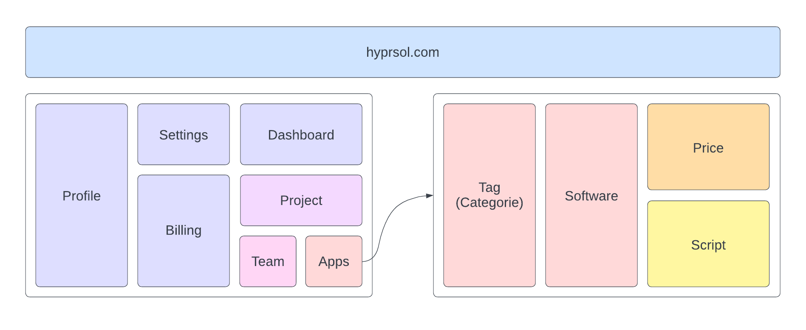
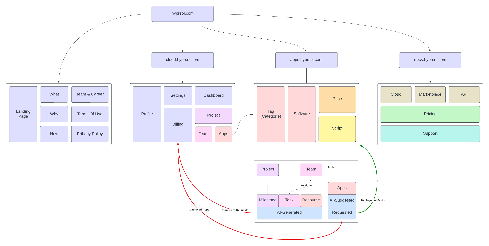

# HyperSol


Welcome to the HyperSol repository! This project is organized into different sections to facilitate development, collaboration, and deployment.

## Quick Start
### Abstract
1. [Background and Problem Statement](#background-and-problem-statement)
2. [Impact and Proposed Solution](#impact-and-proposed-solution)
3. [Project Outcomes and Deliverables](#project-outcomes-and-deliverables)
4. [**Instructions**](#instructions)
### Project Materials
- [Notebooks/Scripts](#notebooksscripts)
- [Demo Recording/GIF](#demo-recordinggif)
- [Presentation PDF](#presentation-pdf)
- [**Code and Files**](#code-and-files)

## Introduction
### Background and Problem Statement: 
In the past 20 years, the internet has changed really fast. Now, with just one click, you can quickly use super powerful computers for your needs. The cloud has also changed how we use hardware. With the AI revolution, the cloud has become a strong support for fast and scalable solution deployment.

In the old days, companies used to hire IT partners to build solutions, and it took months and cost a lot. Nowadays, with the pay-as-you-go model, the cloud makes deployment easier. But there's still a problem – choosing the right software for your business. There are many options, and when you start looking, it can be confusing with all the technology and resources. Finding the right solution at the right deployment cost can be tricky and take a lot of money and time.

How do we solve this problem? How do we find the right solution for your business and help you deploy it within your budget and team's capabilities? You could hire an IT consultant, but they often charge a lot of money. That's where HyprSol comes in to help.

### Impact and Proposed Solution: 
Hyprsol is a powerful AI tool for creating IT solutions. It mainly focuses on open source technologies. It helps you plan, build, and set up your IT projects in any field, even if you don't know much about IT. You just share your project details, and it quickly suggests the best open source solution and simple steps to get started. Hyprsol is for everyone, whether you're not tech-savvy or a tech expert. It saves you a lot of time and resources in finding the right software and deployment method for your needs. Submitting a project is super easy.

Our impact goes beyond just IT solutions; we also highlight the importance of open source technologies and their reuse. We've all seen how closed, proprietary software can fail. With open source, you can always turn to the community for help, suggestions, and improvements. Plus, with the cloud and new technologies, relying on open source is a great option for scalability and migration.

### Project Outcomes and Deliverables: 
Our vision is straightforward: start a project, input project details, submit, and let our AI handle the rest. You'll receive a list of open-source technologies and guidance on how to use them. Based on your preferred deployment method and data governance policies, you decide how to deploy, and we assist you throughout the process. The AI, specifically AI4REC built with Bert, recommends solutions from a vast database, and Generative AI provides step-by-step instructions for deployment. The best part? You don't have to lift a finger; we deploy it for you in the cloud with just one click.



Currently, these features are not fully functional as our model is still learning, but it's showing promising results. Our marketplace has all the apps, but the deployment process is not operational yet. By the end of 2023, we aim to have a fully functional app.

But our vision extends beyond IT solutions. We want to assist students, startups, businesses, non-profits, and more in building their projects. We'll provide roadmaps, milestones, and tasks to guide you on your journey.



## Learn More 
### Demo Recording/GIF: 


Try our web demo yourself on our website [hyprsol.com/beta](https://hyprsol.com/beta).

Our mobile demo is still a work in progress...


### Presentation PDF: 
For a comprehensive overview of HyprSol, check out our pitch at [HyprSol PDF Pitch](assets/pitch.pdf).

## Getting Started:
### Code and Files:
For **HyprSol**, we utilized a diverse set of technologies:

- Our **AI-4-Rec Model** is built with **BERT** and can be found in the `ai/` folder.
- **APIs** were implemented as microservices using **FastAPI**, secured by **Auth0** in the `api/` folder.
- The **Web Client** was developed with **Next.js/React** and resides in the `client/web` folder.
- For **Mobile Client**, we employed **Expo/React Native**, located in the `client/mobile` folder.
- Both platforms share a **UI/UX Styling** folder created with **Tailwind CSS** in the `client/shared` folder.

```
├── ai
│   ├── data/
│   │   └── ...
│   ├── trained_checkpoint/
│   │   └── ...
│   ├── model/
│   │   └── ...
│   ├── README.md
│   ├── requirement.txt
│   └── ...

├── api/
│   ├── project/
│   │   ├── /...
│   │   │   └── ...
│   │   └── main.py
│   ├── software/
│   │   ├── .../
│   │   │   └── ...
│   │   └── main.py
│   ├── README.md
│   ├── requirement.txt
│   └── ...

├── assets/
│   └── ...

├── client/
│   ├── mobile/
│   │   └── ...
│   ├── shared/
│   │   └── ...
│   ├── web/
│   │   └── ...
│   │── README.md
│   └── ...

├── scripts
│   ├── deployment/
│   │   └── ...
│   ├── data/
│   │   └── ...
│   ├── README.md
│   └── ...

└── README.md
```

### Instructions:

1. **AI-4-Rec Model (BERT)**: Navigate to the [`ai4rec/`](./ai4rec) folder and follow the instructions in [`ai4rec/README.md`](./ai4rec/README.md) to understand the AI model and its requirements.

2. **APIs**: Explore the [`api/`](./api) folder to understand the structure of APIs. Refer to [`api/README.md`](./api/README.md) for instructions on running API services.

3. **Web and Mobile Clients**: Inside the [`client/`](./client) folder, you'll find separate folders for web ([`client/web`](./client/web)) and mobile ([`client/mobile`](./client/mobile)) clients. Refer to the respective `README.md` files for running these clients locally.

4. **Deployment Scripts and Data Scraping**: The [`scripts/`](./scripts) folder contains scripts related to deployment and data scraping. Explore [`scripts/README.md`](./scripts/README.md) for more details.

Thank you for exploring HyprSol!
