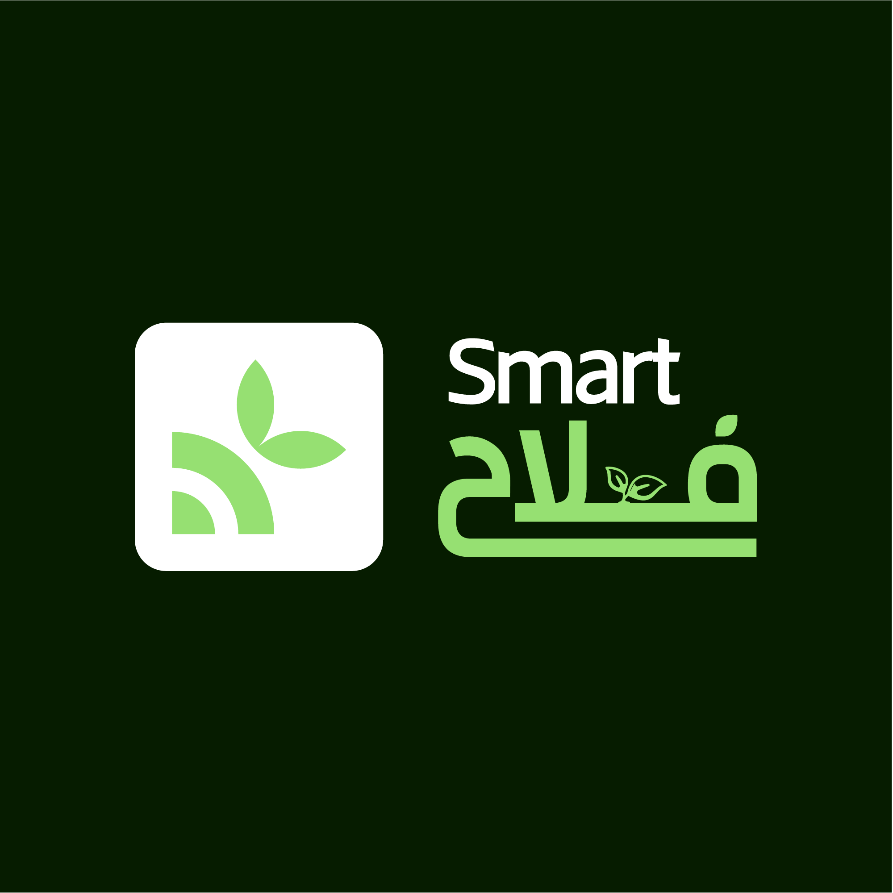

# Smart فْلاّح 🌱

> *Unknown Fella7* - "يد الفلاح نقية"
 

# 🌽 🇲🇦 Farmers

👨🏻‍🌾 [@Mohammed Machrouh](https://github.com/medmac01) - Senior Farmer

👩🏻‍🌾 [@Marwa El Kamil](https://github.com/maghwa) - Senior Farmer

🧑🏻‍🌾 [@Khadija Bayoud](https://github.com/Khadija-Bayoud) - Land Owner

 

# 👀 Problem

Moroccan farmers encounter challenges in making informed decisions due to limited access to crucial agricultural data. Traditional methods of obtaining farming information are inefficient and time-consuming, leading to suboptimal resource utilization, reduced productivity, and lower income. This is particularly evident when farmers explore or initiate farming in new regions, where they lack immediate access to vital data such as weather conditions and soil types, etc. The absence of this essential information makes it difficult for farmers to adapt their cultivation strategies, resulting in potential inefficiencies and decreased yields.
   

# 💭 Proposal
Smart فلاح proposes the development of an LLM-powered chatbot, a user-friendly platform tailored to the specific needs of Moroccan farmers. This chatbot not only answers farmers' questions but also provides valuable insights about agricultural practices. By leveraging region-specific data, weather conditions, and soil types, the chatbot aims to be a comprehensive tool that empowers farmers with timely and relevant information.
   

# 🔑 Key features (Outcomes and Deliverables)

**Crop Insights:** Smart فلاح offers information about crops based on region specifacions, weather conditions, soil type, etc. Allowing farmers to make informed decisions promptly.

**Customized Recommendations:** Smart فلاح tailors its responses to the unique agricultural challenges in Morocco and Africa, providing personalized recommendations for better outcomes.

**Communicates in Moroccan Arabic:** Smart فلاح has the capacity to communicate in Moroccan Arabic, ensuring seamless interaction with farmers and making the platform accessible to a broader audience.

**Reference Links for Validation:** Feature enabling the Smart فلاح to provide reference links to potential websites that contain proof or additional information supporting its responses.

**User-Friendly Interface:** Designed with the end-user in mind, Smart فلاح ensures that farmers, regardless of their technological proficiency, can easily navigate and extract valuable insights from the platform.
   

# 💡 Impact
- The project stands out for its innovation by introducing a chatbot in Moroccan Arabic tailored to farmers' needs. It also offers insights and personalized recommendations, bringing a fresh approach to traditional agricultural assistance.
- The project's impact is evident in its potential to empower farmers with insights and personalized recommendations, fostering informed decision-making and potentially increasing agricultural productivity.
   

# 🤖 LLMs
1. Mixtral-8x7B
2. Seamless-m4t
3. Zephyr-7B
   

# Instructions :
1. `git clone https://huggingface.co/spaces/smart-fellah/Smart-fellah`
2. `pip install -r requirements.txt`
3. `streamlit run app.py`

